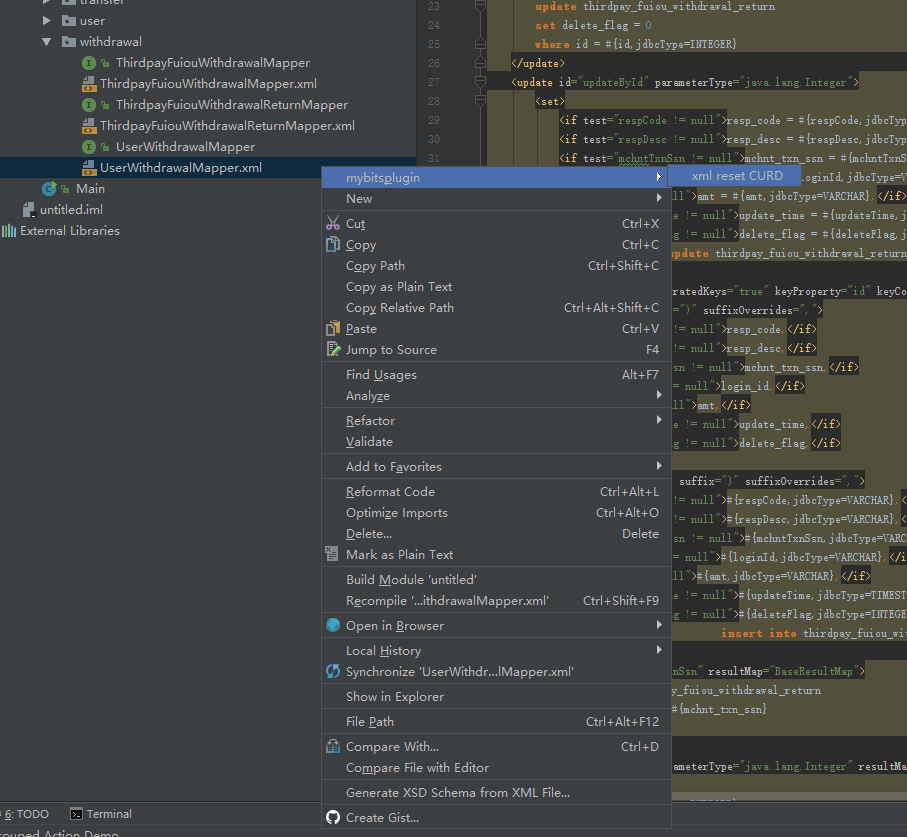

# intellij idea插件项目-mybatis 自定义生成sql语句及其标签
intellij idea插件项目-mybatis 自定义生成sql语句及其标签
<pre>
安装方法：
下载项目中IdeaEasyPlugin.zip 后解压得到IdeaEasyPlugin文件夹
拷贝文件夹到...你的\IntelliJ IDEA\plugins  目录下.
使用方法:
项目中右键选择你的mapper.xml文件，弹出选项面板
</pre>

